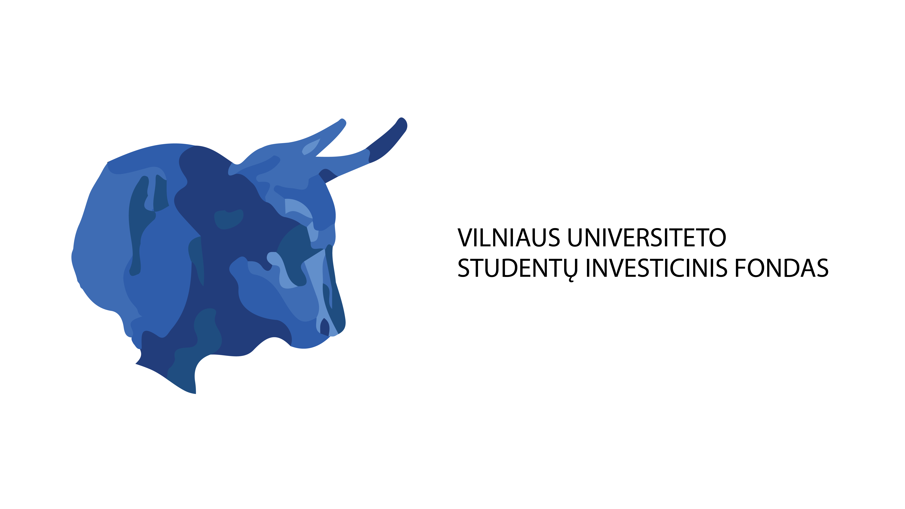
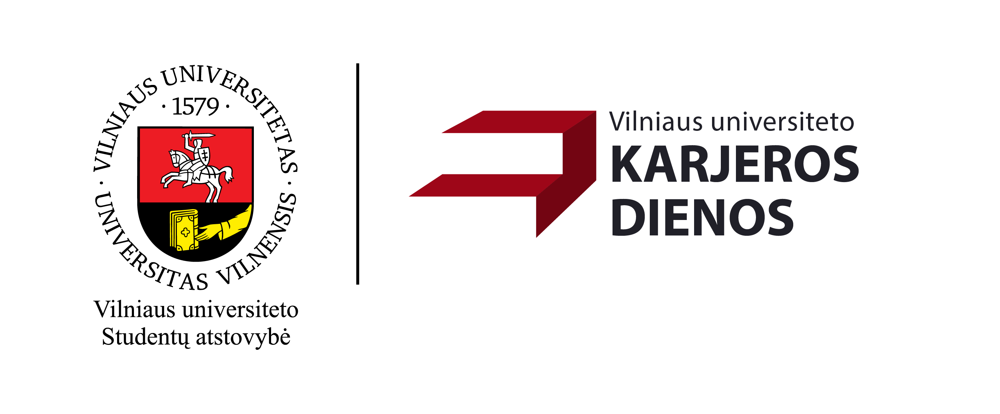

# Programos, klubai ir projektai

## START FM

_Ataskaitiniu laikotarpiu veiklą koordinavo Loranas Vaitkus._

VU radijas START FM – VU SA ir Vilniaus universiteto radijo stotis, veiklą pradėjusi 2005 metais. Vienintelė Lietuvoje studentų radijo stotis suteikia plačias saviraiškos galimybes studentams: padeda rengti būsimus žurnalistus, programuotojus ir kitų sričių specialistus. START FM taip pat aktyviai palaiko alternatyvių Lietuvos ir užsienio atlikėjų ir muzikos grupių kūrybos sklaidą, rengia interviu su muzikos atlikėjais, palaiko įvairias menines bei socialines iniciatyvas. Radijo programa yra skirta Vilniaus miesto ir Lietuvos universitetų bei mokyklų akademinės bendruomenės nariams, jaunimui bei visiems muzikinį išprusimą turintiems šalies gyventojams.

START FM yra unikali terpė jaunimo iniciatyvoms atsirasti ir vystytis: transliuojamos laidos atspindi akademinės bendruomenės ir jaunimo gyvenimo aktualijas, kadangi yra inicijuojamos ir įgyvendinamos bendruomenės narių – Vilniaus universiteto ir kitų Lietuvos aukštųjų mokyklų studentų, absolventų, dėstytojų, ir atspindi akademinės bendruomenės bei jaunimo gyvenimo aktualijas. Stoties visuomeninę reikšmę sustiprina tai, kad radijas START FM visada stengiasi padėti socialinių iniciatyvų kūrėjams, suteikdamas galimybę informuoti visuomenę apie jų vykdomas veiklas ir akcijas.

Ataskaitiniu laikotarpiu buvo rengtos ir transliuotos kultūrinio, šviečiamojo, informacinio pobūdžio laidos, sudarytos sąlygos VU žurnalistikos studentams įgyti praktinių žinių ir įgūdžių. Per šį laikotarpį laidose svečiavosi labai gausus būrys svečių, pradedant Seimo primininke Viktorija Čmilytė-Nielsen ir baigiant visuomenininkais Edmundu Jakilaičiu ar Skirmantu Malinausku.

## VU Debatų klubas

_Ataskaitiniu laikotarpiu veiklą koordinavo Olena Pankevych._

VU Debatų klubas – 2004 m. įkurtas klubas, skirtas skirtingų fakultetų studentų (-čių) bendravimo skatinimui, suteikiantis erdvę kritinio mąstymo, argumentavimo, anglų kalbos ir viešojo kalbėjimo įgūdžių lavinimui bei atstovaujantis Vilniaus universitetui debatų turnyruose.

VUDS managed to host a debating competition this March - Vilnius Cup 2024, which revived the tradition of competitive British Parliamentary debate in Lithuania. Apart from this grand achievement, we sustain the weekly meetings, where we give a chance to an ever-growing community to practice this craft, as well as provide our knowledge in the field with frequesnt workshops. VUDS Council team managed to also organise and facilitate our participation in four international debate championships, furthering the access of Lithuanian debaters to a vast and flourishing community abroad. Finally, we seek to establish as much institutional legacy for the forecoming VUDS teams through establishing a firm social media presence and writing the Statutes of our Society.

## „Studentai - moksleiviams, moksleiviai - studentams“

_Ataskaitiniu laikotarpiu projekto veiklą nuo 2024-03-20 koordinavo Laurynas Cicėnas._

„Studentai – moksleiviams, moksleiviai – studentams" – VU SA organizuojama 2-3 dienų trukmės stovykla, skirta vyresnių klasių moksleiviams (-ėms). Stovyklos tikslas – padėti moksleiviams (-ėms) pasirinkti jiems (-oms) tinkamą studijų kelią, supažindinant su Vilniaus universitetu ir jo teikiamomis galimybėmis.

Balandžio 20-21 dienomis Vilniaus universitete vyko jau tapęs pavasario tradicija renginys - stovykla “Studentai - moksleiviams, moksleiviai - studentams”.

Renginio metu moksleiviai susipažino su Vilniaus universitetu, Studentų atstovybe, lavino komandinio darbo įgūdžius ir leidosi į kelionę po VU padalinius.

O įgyti žinių apie universitetą ir studentišką gyvenimą moksleiviams padėjo kuratorių komanda.

## VU Teisės klinika

_Ataskaitiniu laikotarpiu projektą iki 2024-01-01 koordinavo Viktorija Medžiaušaitė, nuo 2024-01-01 Karina Sinkevičiūtė._

VšĮ Vilniaus universiteto Teisės klinika (VU TK) – nemokamos teisinės pagalbos projektas, kuris suteikia tikros profesinės praktikos galimybę vyresniųjų kursų teisės studentams (-ėms), o visuomenei siūlo nemokamą teisinę pagalbą ir skatina teisinį raštingumą. Prieš 26 m. VU TK įsteigė ir iki šiol ją globoja VU SA, Vilniaus universitetas ir advokatų kontora Ellex Valiūnas.

2023 m. teisinę pagalbą organizacija suteikė 5922 gyventojams (-oms). Remiantis interesantų atgaliniu ryšiu apie organizacijos veiklos kokybę galima daryti išvadą, kad VU TK užtikrina pakankamai aukštą kompetencijos lygį ir gerą aptarnavimo kultūrą. 2023 m. sėkmingai vykdytos konsultacijos gyvai, telefonu, elektroniniu paštu.

Ataskaitiniu laikotarpiu VU TK privalomąją profesinę arba savanorišką praktiką, kurios trukmė 6 mėn., atliko 21 Vilniaus universiteto studentai (-ės). Praktikos metu studentai (-ės) konsultavo interesantus (-es) šeimos, paveldėjimo, darbo, intelektinės nuosavybės, sutarčių, nekilnojamojo turto, vartotojų, administracinės, baudžiamosios teisės klausimais. Taip pat rengė sutarčių projektus, procesinių dokumentų projektus teisminėms institucijoms (teismams, darbo ginčų komisijoms), teisines išvadas.

VU TK aktyviai bendradarbiavo su visuomenės informavimo priemonėmis, reguliariai teikė teisinius komentarus populiariausiems portalams. Parengtos publikacijos tokiomis temomis kaip “Santuokos nutraukimas nustačius vieno iš sutuoktinių kaltę – kokios pasekmės?“, „Saugotojo atsakomybė už jam patikėtus saugoti daiktus“, „Apie vaiko išlaikymo indeksavimą trumpai – kaip ir kada tą padaryti?“, „Užlietas apačioje esantis butas: kas turi atlyginti padarytą žalą?“, „Teistumas: kas tai yra ir kada išnyksta?“, „Palikimo priėmimas faktiškai pradėjus jį valdyti: ką svarbu žinoti?“, „Santuokos nutraukimas turint vaikų: į ką atkreipti dėmesį?“.
Ataskaitiniu laikotarpiu nebuvo vykdytas joks projektas. Pasirašyta paramos sutartis su „Avia Solutions Group", kuria susitarta dėl rėmėjo statuso suteikimo įmonei, abipusio bendradarbiavimo bei finansinės paramos VU TK.

## VU SIF

_Ataskaitiniu laikotarpiu fondui vadovavo Povilas Petručionis._

Vilniaus universiteto Studentų investicinis fondas (VU SIF) – VU SA įsteigtas pirmasis ir didžiausias studentų (-čių) investicinis fondas Lietuvoje, skatinantis jaunimą domėtis investicijų valdymo pasauliu ir savarankiškai investuoti.

Kiekvieną savaitę vykdome susitikimus, kurių metu analizuojame rinkas, siekdami optimizuodami investicinio portfelio grąžą bei ieškome naujų kompanijų ir diskutuojame ar jos teigiamai įsilietų į mūsų portfelį. Taip pat dalyvavome Harvardo konkurse, kuriame savo investicinėmis žiniomis varžėmės su kitų šalių universitetų komandomis. Organizavome renginius apie investavimą, mokesčius ir skaidrų verslą, į pastarąjį pritraukėme beveik 100 dalyvių. Stipriai augome Tik Tok platformoje, mūsų šviečiamojo pobūdžio vaizdo įrašai renka iki 30 000 peržiūrų. Užmezgėme partnerystes ir sėkmingai bendradarbiaujame su EVAF Merkurijaus dienomis bei LR Finansų ministerija. Galiausiai fonde vykdome mentorystės programą, jos metu esami nariai gali tobulinti savo žinias bendraudami su fondo alumnais - savo sričių profesionalais.

## VU Karjeros dienos

_Ataskaitiniu laikotarpiu projektui vadovavo Livija Trakelytė._

Vilniaus universiteto Karjeros dienos (VU KD) – VU SA projektas, leidžiantis studentams (-ėms) susipažinti su potencialiais (-iomis) darbdaviais (-ėmis), užmegzti naujus ryšius ir savarankiškai pradėti karjeros kelią. Projektu siekiama padėti studijuojantiesiems (-čiosioms) įsitvirtinti darbo rinkoje ir tapti paklausiais (-iomis) savo srities specialistais (-ėmis).

19 metus vykstantis Vilniaus universiteto Karjeros dienų projektas šiemet dalyvius kvietė dalyvauti įvairiuose renginiuose, diskutuoti aktualiomis temomis bei artimiau susipažinti su darbo rinkos perspektyvomis bei naujienomis.

Pagrindinės savaitės metu įvyko 126 Greitieji darbo pokalbiai, kurie metų dalyviai turėjo galimybę išbandyti savo jėgas darbo pokalbių simuliacijose, o dvi dienas vykusioje Kontaktų mugėje studentams buvo suteikta proga iš arčiau pažinti bei užduoti klausimus atstovams iš 54 įmonių bei organizacijų.

## Be etikečių

_Ataskaitiniu laikotarpių veiklą koordinavo Gabija Smailytė._

„Be etikečių" – nuo 2010 m. VU SA vykdoma programa, aktyviai veikianti socialinės atskirties mažinimo ir žmogaus teisių srityse. Programa siekiama paneigti visuomenėje nusistovėjusius stereotipus, skatinti visapusę socialiai pažeidžiamų grupių integraciją bei kurti pagarbų tarpusavio santykį Vilniaus universiteto bendruomenėje. Pagrindinės vertybės – lygybė, atvirumas ir pagarba kiekvieno žmogaus individualumui.

2023-2024 metais „Be etikečių trečią kartą suorganizavo LGBTQ+ bendruomenei burti skirtą festivalį „Kultūra visų”, kuriame buvo siūloma aplankyri ne tik tradicija tampančius renginius, bet ir atsinaujinusi programa, Per mokslo metus buvo susitelkta į renginių organizavimą ir naujojo Be etikečių Youtube kanalo plėtimą, viską ruošiant emocinės gerovės, intersekcionalaus feminizmo ir smurto prevencijos temomis. Savarankiškai buvo suorganizuoti dar 6 renginiai bei buvo dalyvauta ir kitų VU SA P ir VU SA PKP renginiuose.

## VU Jaunųjų energetikų klubas

_Ataskaitiniu laikotarpiu veiklą koordinavo Paulius Rimkevičius._

Vilniaus universiteto Jaunųjų energetikų klubas (VU JEK) – VU SA klubas, vienijantis jaunimą, besidomintį įvairių rūšių energetika ekonominiais, politiniais ir techniniais aspektais. Organizuodami (-os) renginius bei skleisdami (-os) informaciją, VU JEK nariai (-ės) dalijasi turimomis energetikos žiniomis.

Šiais metais JEK aplankė hidroelektrinę, kogeneracinę elektrinę, Litgrid valdymo bloką, turėjo žygį iki Ignalinos AE, nuvyko į Antalieptę (JEK prižiūrimą muziejų), mokyklą, surengė ne vieną paskaitą ir kitų renginių. Šiemet daug dėmesio buvo skirta bendruomenės formavimui, pavyko pritraukti nemažai aktyvių naujų narių.

## Erasmus Student Network Vilnius University

_Ataskaitiniu laikotarpiu programos veiklą koordinavo Artūras Maciunskas._

ESN Vilnius University – VU SA programa, skatinanti studentų (-čių) mobilumą bei padedanti užsienio studentams (-ėms) sėkmingai integruotis į Vilniaus universitetą. Pagrindinis ESN Vilnius University tikslas – padėti į VU atvykstantiems (-čioms) užsienio studentams (-ėms) prisitaikyti naujoje aplinkoje, supažindinti juos (-as) su studijų tvarka, mūsų šalies kultūra bei tradicijomis.

Šie metai buvo puikūs ESN Vilnius University komandai. Surengėme daugybę nacionalinio lygio renginių ir net vieną tarptautinio lygio renginį, kuriame dalyvavo daugiau nei 120 dalyvių ir kuris buvo pirmasis tokio pobūdžio renginys Lietuvoje. Be to, surengėme daugiau nei 100 vietinio lygio renginių, kuriais galėjo mėgautis visa Vilniaus universiteto bendruomenė. Šie puikūs renginiai skatino kultūrinius mainus, ekologines iniciatyvas ir darė socialinį poveikį vietinei bendruomenei. Taip atstovavome mūsų organizaciją didžiausiame Europoje studentų renginyje EGM (Erasmus Generation Meeting). Komandos darbo dėka, dar labiau išaugo "Erasmus" studentų pasitenkinimo lygis, vis daugiau sulaukiame studentų, kurie kreipiasi į "Erasmus" Vilniaus universitete remdamiesi savo draugų rekomendacijomis.

## VU Kendo klubas

_Ataskaitiniu laikotarpiu veiklą koordinavo Vytenis Almonaitis._

Vilniaus universiteto Kendo klubas – nuo 2008 m. veikianti VU SA japoniško fechtavimo studija, skirta tiek pradedantiesiems (-čiosioms), tiek norintiems (-čioms) tobulinti jau turimus įgūdžius. VU Kendo klubas siekia ne tik populiarinti kendo sportą ir skatinti aktyvią gyvenseną, bet ir burti japoniškais kovos menais besidominčius (-čias) studentus (-es), garsinti Vilniaus universiteto vardą Lietuvoje ir pasaulyje, dalyvaudamas varžybose ir kituose renginiuose.

Klubo užsiėmimuose dalyvauja ne vien studentai, bet ir Vilniaus Universiteto alumnai. Tradiciškai VU kendo klube organizuojami kursai pradedantiesiems. Kurso trukmė 1mėn.Kurso metu dalyviai nemokamai aprūpinami reikiamu inventoriumi. Klubas organizuoja bei aktyviai dalyvauja įvairiuose Vilniaus Universiteto renginiuose pristatant ir populiarinant kendo studentų tarpe.

Šiais mokslo metais klubas:

- Nuo sausio mėn., šeštadieniais organizavo bendras Lietuvos kendo rinktinės treniruotes su kitų Lietuvos nacionaline kendo rinktine, kad pasiruoštų 19-tam Pasaulio kendo čempionatui, vyksiančiam Milane liepos 4 - 7d.
- Balandžio 13 - 14d. dalyvavome tarptautiniame kendo turnyre Riga Open 2024 Rygoje. Turnyre užėmėme 2-trą vietą jaunių ir 2-trą vietą kyu kategorijose. Padėjome surengti dvi bendras Lietuvos kendo klubų treniruotes, o balandžio 20d pažintinę iaido treniruotę.
- Atliko kendo demonstraciją Vilniaus miesto japoniško sodo atidarymo ceremonijoje balandžio 29 d.
- Gegužės 27 d. planuoja demonstraciją Japonijos ambasados organizuojamame renginyje vaikų namų auklėtiniams (-ėms) „Būkime kartu".

## HEMA

_Ataskaitiniu laikotarpiu klubui vadovavo Gintarė Vaičekauskytė._

Alber aus VU HEMA klubas – istorinių Europos kovos menų klubas, kuriame treniruojamasi ilgaisiais kalavijais.

Hemos klubas dalyvavo įvairiuose turnyruose, šventėse ir mugėse - Daili kazė, Fidi dinozauro ataka, Hanza dienose, gyvosios archeologijos dienos Kernavėje XXIII. Taip pat buvome pakviesti pravesti pamokas ar turnyrus, matome augantį susidomėjimą ne tik tarp narių, bet ir tarp įvairių organizacijų ir veiklų. Taip pat surengėme antrąjį savo turnyrą "Alberio kalavijas" vykusį bastėjoje ir dalyvaujant ne tik dalyviams iš visos Lietuvos, bet ir iš užsienio, trys mūsų nariai iškovojo prizines vietas. Džiaugiamės savo nariais, kurių tobulėjimą galėjome matyti ir pirmą kartą kaip klubas sudalyvavę turnyre už Lietuvos ribų, Rygoje, kuriame mūsų nariai taip pat iškovojo prizinių vietų.

## The COINS

_Ataskaitiniu laikotarpiu projektą koordinavo Eivinas Zableckas._

Gyvybės mokslų konferencija The COINS – VU SA projektas, organizuojamas studentų (-čių). Tai yra mokslinis renginys, kuriuo siekiama skatinti studentų (-čių) mokslinę veiklą, domėjimąsi naujausiais mokslo pasiekimais bei plėsti akademinius ir profesinius ryšius. Konferencija kviečia aukščiausio lygio mokslininkus (-es) skaityti pranešimus mūsų Universitete, taip garsinant jį akademinėje tarptautinėje bendruomenėje. Taip pat siekiama šviesti moksleivius (-es) bei visuomenę apie mokslo naujienas, leisti susipažinti su gyvybės mokslų tyrimais, taip skatinant pasirinkti savo profesinį kelią būtent šioje srityje. Gyvybės mokslų konferencija The COINS – VU SA projektas, organizuojamas studentų (-čių). Tai yra mokslinis renginys, kuriuo siekiama skatinti studentų (-čių) mokslinę veiklą, domėjimąsi naujausiais mokslo pasiekimais bei plėsti akademinius ir profesinius ryšius. Konferencija kviečia aukščiausio lygio mokslininkus (-es) skaityti pranešimus mūsų Universitete, taip garsinant jį akademinėje tarptautinėje bendruomenėje. Taip pat siekiama šviesti moksleivius (-es) bei visuomenę apie mokslo naujienas, leisti susipažinti su gyvybės mokslų tyrimais, taip skatinant pasirinkti savo profesinį kelią būtent šioje srityje.

The COINS 2024 – 18-oji tarptautinė gyvybės mokslų konferencija, organizuota vien studentų (-čių) iniciatyva. Šis VU SA projektas suteikia galimybę studentams (-ėms) pristatyti savo mokslinius darbus, kurių šiemet buvo rekordiškai daug, taip pat susipažinti su lektoriais iš įvairių pasaulio šalių ar daugiau sužinoti apie praktikos galimybes studentams (-ėms). The COINS organizuoja ir visuomenės bei moksleivių programas, kurios skatina plačiąją visuomenę iš arčiau susipažinti su mokslo pasauliu. Šiemet konferencijos organizatorių komanda jungė skirtingus VU fakultetus bei pakopas, o The COINS 2024 sulaukė daugiau nei 800 dalyvių.

## Jaunųjų žurnalistų draugija

_Ataskaitiniu laikotarpiu draugijai vadovavo Ieva Radzevičiūtė._

Vilniaus universiteto Jaunųjų žurnalistų draugija (VU JŽD) – 2021 m. įkurta moksleivius (-es) ir studentus (-es) vienijanti iniciatyva, kurios tikslas sukurti žurnalistika besidominčių ir demokratinius idealus puoselėjančių jaunų žmonių bendruomenę Lietuvoje.

2023–2024 m. laikotarpyje VU JŽD bendruomenė buvo aktyvi ir produktyvi. Vien per šiuos metu draugijos nariai publikavo apie 25 žurnalistinius kūrinius „15min“ ir 12 publikacijų „Bernardinai“ portaluose.

Rugsėjį jau antrus metus iš eilės vyko Romo Sakadolskio žurnalistikos forumas, kurio metu VU JŽD nariai ne tik skaitė pranešimus, bet ir Jaunųjų žurnalistų premija apdovanojo 4 jaunuosius žurnalistus už autorinius žurnalistinius darbus skirtingų raiškų kategorijose. Taip pat antrą kartą organizavome Mentorystės programą, kurioje dalyvavo 17 mentorių iš skirtingų žiniasklaidos priemonių, o su jais mokėsi 28 studentai.

Draugija organizavo ir įvairius renginius. Pavyzdžiui, neseniai vyko „Istorijų vakaras su žiniasklaidos atstovais“, o renginyje savo patirtimi dalijosi Ramūnas Zilnys, Tomas Jokūbonis, Šarūnas Černiauskas, Jūratė Damulytė. EYE VILNIUS renginyje, VU JŽD nariai su LRT žurnaliste Jurga Bakaite jaunuolius supažindino su tuo, kaip žiniasklaidoje yra tikrinami faktai. Greitu metu vyks ir Žurnalistų dienos (leŽuDi), prie kurių organizavimo taip pat prisideda Draugija. Ir tai tik keli pavyzdžiai.

Kad žinių bagažas būtų dar didesnis, patys VU JŽD nariai dalyvavo įvairiuose mokymuose, kuriuose žiniasklaidos atstovai supažindino su žurnalistikos virtuve.

Galima teigti, kad šie metai buvo pilni iššūkių, kurie leido tobulėti, kurti toliau ir garsinti ne tik Draugijos, bet ir Vilniaus Universiteto vardą.

## Karybos klubas

_Ataskaitiniu laikotarpiu klubui vadovavo Robertas Ruzgas._

VU Karybos Klubo užduotis apjungti visus VU studentus, turinčius patirties ar besidominčius Lietuvos ir pasaulio karyba, nacionaliniu saugumu. Klubas aprėpia bendras veiklas tokias kaip: eiliniai, planuoti susitikimai, diskusijos, pristatymai, svečių paskaitos, renginiai, istorinių vietų, muziejų lankymas, o komandos stiprinimui - aktyvios komandinio sporto veiklos : tinklinis, krepšinis, futbolas, dažasvydis, šaratasvydis. Šiais metais socialiniuose tinkluose dalintasi informacija apie karybą ir organizuotos diskusijos šia tema.

Per 2023-2024 metus VU Karybos klubas:

Organizavo mokomąjį žygį "Kaip išgyventi žiemos sąlygomis", vyko į ekskursija į Kauno karo technikos muziejų ir KGB Bunkerį. Taip pat dalyvavome knygos "Karo nuotaka" pristatyme ir kelių kitų knygų pristatymuose, bendravome su autoriais. Kartu stebėjome Lietuvos Kariuomenės paradą, organizavome dvi Dr. Šlekio karybos istorijos paskaitas. Dalyvavome TSPMI bendruomenės protmūšyje ir padėjome kurti jam klausimus, ir tiesiog susitikdavome geram laikui kartu!

## Naujos iniciatyvos

Ataskaitiniu laikotarpiu buvo siekiama plėsti ir didinti studentų (-čių)
iniciatyvų tinklą. Šiam tikslui įgyvendinti jau trečius metus iš eilės
organizuotas iniciatyvų kūrimosi renginys „HackVU", kurio metu mūsų
bendruomenę papildė keletas naujų iniciatyvų.

## Laisvalaikio draugija „Kauliukas“

_Ataskaitiniu laikotarpiu draugijai vadovavo Robert Berlin._

Laisvalaikio draugija „Kauliukas“ (LDK) – VU SA klubas, skirtas turiningai praleisti laisvalaikį studentams. Tai yra puiki proga susipažinti su bendraminčiais iš skirtingų Vilniaus universiteto fakultetų.

LDK išsiskiria nuo kitų klubų savo veiklomis. Organizuojami visokiausi renginiai, kurie leidžia atsipūsti, pramankštinti protą, pasijuokti ir susirasti naujų draugų. Šio klubo rengiami stalo žaidimų vakarai ir protmūšiai suteikia progą smagiai ir įdomiai praleisti laiką, o ypatingieji PowerPoint vakarėliai bei memų veiklos skatina studentus išreikšti jų kūrybiškumą netradiciniais būdais.

„Labai linksmas ir šiltas klubas, turintis platų žaidimų pasirinkimą ir linksmą kompaniją, kuri padeda greitai suprasti žaidimų taisykles. Dalyvavimai renginiuose yra vieni mano mėgstamiausių prisiminimų iš Vilniaus.
Gintaras Usevičius, VU nanochemijos studentas“

Visa gyvybė taip pat klesti LDK Discord serveryje, kuriame vietą sau ras kiekvienas - nuo muzikos mėgėjo iki dailininko. Su įvairiausiais skirtingo pobūdžio kanalais studentai yra skatinami puoselėti savo hobius ir kurti draugišką aplinką kitiems nevaržomai dalintis savo darbais ir pomėgiais.

„Džiaugiuosi gavus galimybę susipažinti su šiais įdomiais žmonėmis, kadangi įstojus į universitetą man visada trūko ryšio su kitų fakultetų ir kursų studentais.
Gustė Šliožaitė, VU psichologijos studentė“

Prie šio klubo gali prisijungti bet kuris studentas, tad jeigu susidomėjai – spustelk nuorodą ir tapk Kauliuko bendruomenės nariu! Visa informacija apie būsimas veiklas yra dalinamasi per LDK Discord serverį.

Nuo gruodžio 2 dienos vyko 5 Memų triatlonai ir 12 Žaidimų vakarų

## Ukrainian youth group in Lithuania

_Ataskaitiniu laikotarpiu klubui vadovavo Anna Humenna._

UYGL is about uniqueness, being the first group of its kind in Lithuania. UYGL is about youth because they are the driving force of a country. UYGL is about gratitude, especially to Lithuania, the country that sheltered us and became a home far away from home. And most importantly, UYGL is about loyalty to our country because our soul is in Ukraine! «Wherever a Ukrainian heart beats in this world – there is Ukraine!»

Ukrainian Youth Group in Lithuania and its members are proud of organising events and exhibitions while being established only for a few months. An exhibition The Color of Steel took place in Vilniaus Švč. Trejybės Graikų apeigų katalikų bažnyčia and Seimas, which was the first and very memorable big achievement of ours. UYGL also joined worldwide exhibition Unissued Diplomas and held it in Vilnius University and Ukrainos centras. Our first event Ukrainian Unity Day brought us great memories and experience that enriches our work right now. Furthermore, episodes First Hours of War are an amazing piece of work that helped to raise awareness about the war in Ukraine, and gave a platform for young Ukrainians and Lithuanians to share their experience and thoughts. More important and valuable projects are coming this year.

## SPEAK

_Ataskaitiniu laikotarpiu klubui vadovavo Sofia Vyakhirieva._

SPEAK is a social initiative that connects foreigners and locals through a language exchange program. Local volunteers can share their own language with newcomers, help them to adapt in a country, build new connections, and foster friendships

SPEAK is a social initiative that connects foreigners and locals through a language exchange program. Local volunteers can share their own language with newcomers, help them to adapt in a country, build new connections, and foster friendships. Throughout 2024, we were able to launch 8 language learning groups with more than 50 participants. With SPEAK's contribution, VU helped international students feel more included and welcome in the community, as well as build new connections and bridges with local students

## Klubas „Artì“

_Ataskaitiniu laikotarpiu klubui vadovavo Austėja Bačiulytė._

Artì – tai dailės ir rankdarbių klubas jungiantis meniškus Vilniaus universiteto bendruomenės narius. Siekiame sukurti aplinką, kurioje kiekvienas galėtų atskleisti save kūrybiškai bei per meno prizmę atkreipti visuomenės dėmesį į aktualias problemas. Kadangi esame naujai susikūręs klubas vykdysime dailės ir rankdarbių užsiėmimus kiekvieną savaitę, kuriuose semsimės patirties vieni iš kitų bei reguliariai organizuosime parodas ir dirbtuves bendruomenei įvairiomis tematikomis. Galiausiai, mokslo metus uždarysime visų metų darbų paroda „Meno pieva“

## Studentų mokslinė draugija „(Un)discovered Asia“

_Ataskaitiniu laikotarpiu klubui vadovavo Vesta Šiaudvytytė._

Studentų mokslinė draugija „(Un)discovered Asia“ oficialiai įsikūrė dar visai neseniai – 2024 m. kovo 28 d. Tačiau jau džiaugiamės begale savo pirmųjų pasiekimų: „HACKVU“ hakatone su draugijos idėja užėmėme 3-iąją, prizinę vietą, iš viso jau turime 17 narių, surengėme du draugijos narių susitikimus, o per Azijos ir transkultūrinių studijų instituto 3-jų dienų festivalį „ATSIbusk“ surengėme pirmąjį, mokslinės draugijos atidarymo renginį! Aš, draugijos vadovė Vesta Šiaudvytytė (Indijos ir Pietų Azijos studijos, bakalauras, II kursas), labai tuo džiaugiuosi ir didžiuojuosi. Mūsų mokslinė draugija – tai terpė vystyti ir plėtoti mokslines ir kitas idėjas, susijusias su Azijos regionu. Mūsų veiklos: akademinių ir mokslo populiarinimo straipsnių rašymas, renginių organizavimas, susibūrimai ir kt. Į savo mokslinę draugiją siekiame pritraukti ne tik VU studentus ir studentes, bet ir narius iš užsienio (be to, jau turime vieną indologę doktorantę iš Ukrainos savo draugijoje).

## Studentų pilietinio pasipriešinimo komitetas

_Ataskaitiniu laikotarpiu klubui vadovavo Gytis Oškelis._

Reaguojant į geopolitinę situaciją ir poreikį sukurti studentų organizaciją, kuri šviestų ir motyvuotų jaunimą dalyvauti pilietinio pasipriešinimo iniciatyvose, įkurtas Studentų pilietinio pasipriešinimo komitetas (SPPK).

Bendradarbiaujant su kitomis NVO ir pilietinio pasipriešinimo ekspertais, SPPK rengs tokias veiklas kaip:

- Diskusijas apie studentų svarbą ginant mūsų šalį;
- Paskaitas apie šlovingą Lietuvos istoriją ir studentų vaidmenį joje;
- Dalinsimės informacija apie tai, ką asmenys ar jų šeimos nariai turi žinoti apie pilietinį pasipriešinimą;
- Organizuosime informatyvius žygius pilietinio pasipriešinimo tematika;
- Įdomias veiklas su įvairių sričių ekspertais, politikais ir karininkais;
- Įvairius kitus renginius bei užsiėmimus.

## Labdaros ir paramos fondas „Ateičiai"

_Ataskaitiniu laikotarpiu fondui vadovavo Edvardas Tamutis._

2018 m. VU SA įkūrė labdaros ir paramos fondą „Ateičiai", skirtą Vilniaus universiteto studentų (-čių) gerovei kurti. Fondas įkurtas siekiant atstovauti įvairiems studentų (-čių) poreikiams. Šiais metais labdaros ir paramos fondas „Ateičiai" viešino ir garsino Vilniaus universiteto vardą platindamas atributiką tiek fizinėje, tiek elektroninėje parduotuvėse. Šiemet buvo tęsiamos ir toliau atidaromos išvažiuojamosios vienos dienos parduotuvės įvairiuose Universiteto padaliniuose bei sudaryta galimybė studentams (-ėms) įsigyti atributikos vykstančių Unversiteto renginių metu. Ataskaitiniu laikotarpiu fizinė Vilniaus universiteto atributikos parduotuvė persikėlė į naujas patalpas Senamiestyje – taip didinamas VU vardo žinomumas tarp užsienio turistų ir miesto svečių. Toliau tęsiamas bendradarbiavimas su VU Komunikacijos ir rinkodaros skyriumi dėl Vilniaus universiteto atributikos viešinimo VU komunikacijos kanalais - naujienlaiškiais bei socialiniais tinklais.

Fondas ne tik toliau tęsia bendradarbiavimą su VU, tačiau ir plečia asortimentą pasirašant sutartis su išorės įmonėmis. Ataskaitiniu laikotarpiu pasirašyta bendradarbiavimo sutartis su Vilniaus turizmo informacijos centru „Go Vilnius“ dėl gaminamos produkcijos platinimo bei prekybos, taip pat pasirašyta bendradarbiavimo sutartis su „Listee“, kurių asortimentą sudaro rankų darbo apranga su Lietuvos ar Ukrainos vėliavų motyvais. Toliau tęsiama prekyba ir Klaipėdos universiteto atributika. Šiais metais toliau vykdoma iniciatyva – renkama 1,2 % GPM parama, kuria bus tikslingai siekiama skatinti Universiteto studentus(-es) už aktyvią visuomeninę veiklą prisidedant prie jaunimo / studentų / visuomenės pilietinį aktyvumą bei pilietiškumą skatinančių iniciatyvų. Iš anksčiau surinkto 1,2 % GPM ir dondo lėšų šiais metais įsteigta Labdaros ir paramos fondo „Ateičiai“ vardinė stipendija, kuri skirta Universiteto studentams (-ėms) už aktyvią visuomeninę veiklą prisidedant prie Ukainos piliečių integracijos Lietuvoje.

Labdaros ir paramos fondo „Ateičiai" veikla yra socialiai atsakinga bei kurianti kapitalą dėl Vilniaus universiteto studentų (-čių) gerovės.
