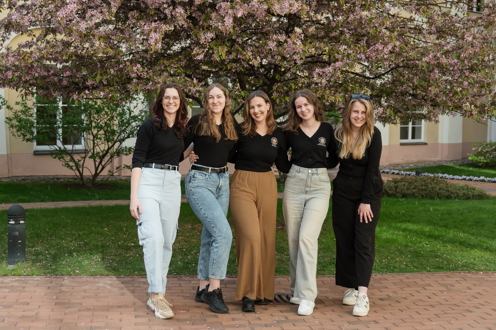

# Institucinio stiprinimo fondas

::: tip 📖 Institucinio stiprinimo fondas...
Institucinio stiprinimo fondas yra atsakingas už organizacijos narių kompetencijų kėlimą, žmogiškųjų išteklių valdymą. Fondas siekia užtikrinti sąlygas VU SA stiprinti ir nuosekliai kelti kompetencijas organizacijoje.
:::

::: details 2023–2024 m. Institucinio stiprinimo fondą sudarė...

- Julija Jarutytė
- Gabija Daunoravičiūtė
- Kornelija Buivydaitė
- Margarita Aleksynaitė
- Aušrinė Tverskytė

:::

Institucinis stiprinimas – visuma procesų, orientuotų į poreikiu grįstą organizacijos bei atskirų jos vienetų ar veiklų tobulinimą, jos narių bendrųjų ir specifinių kompetencijų ugdymą, institucinės atminties stiprinimą, veikloms reikalingų įrankių, priemonių bei metodų kūrimo inicijavimą.

Šiais metais Institucinio stiprinimo fondas ne tik rūpinosi organizacijos narių kompetencijų kėlimu, tačiau ir vykdė šiuos projektus:

- Tęsė programą „VU SA Reflektuoja“ ir skatino organizaciją reflektuoti ir savireflektuoti. Nuolatinis reflektavimas leidžia nuosekliai įsivertinti stipriąsias ir silpnąsias organizacijos narių, veikų ir procesų puses, taip pat skatina efektyvumą.
- Subūrė darbo grupę įtraukiant alumnų bendruomenę su tikslu į organizacijos veiklas aktyviau įtraukti organizacijoje veikusius alumnus. Darbo grupė tęs savo veiklą iki liepos 1 d.
- Atnaujino VU SA lektorių duombazę. Duombazė padeda organizacijos nariams pažinti daugiau organizacijos narių, kurie gali padėti kelti kompetencijas, pasidalinti savo patirtimis.
- Įvykdė bendruomenės tyrimą. Daugiau apie tyrimą galima rasti [šioje nuorodoje.](../stipri-organizacija/tyrimai.md#vu-sa-integracijos-tyrimas)
- Peržiūrėjo ir koordinavo patirties perdavimo procesą. Suorganizuoto atskiro susitikimo metu buvo pristatytas patirties perdavimo procesas ir jo etapai, suteiktos naudingos nuorodos.
- Organizavo iniciatyvas skatinant viešinti atstovavimo veiklą tarp organizacijos narių. Iniciatyvų tikslas yra ne tik supažindinti su atstovavimo procesu, bet ir paskatinti organizacijos narius tapti studentų atstovais.

Ataskaitiniu laikotarpiu ir toliau tęstas sistemingas darbas žmogiškųjų išteklių srityje:

- Vasarą įvyko bendri sričių planavimai pagal Biuro-Tarybos išvažiavimo metu išskirtas svarbiausias problemas;
- Ir toliau vykdyti reguliarūs Institucinio stiprinimo fondo ir žmogiškųjų išteklių koordinatorių susitikimai (iš viso 6), kurių metu buvo nagrinėtos organizacijai ir jos nariams aktualios temos:
- Narių pritraukimas, įveiklinimas ir išlaikymas;
- Laiko ir veiklų planavimas;
- Refleksijų kultūra;
- Lektorių duomenų bazė;
- Visuotiniai susirinkimai;
- Mokymų organizavimas ir planavimas;
- Patirties perdavimo procesas.
- Kompetencijų kėlimo procesai vyko ne tik mokymų, bet ir reguliarių visuotinių susirinkimų, simuliacijų metu;

Centriniu mastu organizuoti mokymai:

- Vasaros mokymai;
- Kuratorių mokymai;
- Vadovavimo mokymai koordinatoriams;
- Vadovų programa;
- Studentų atstovų mokymai;
- Pavasario narių mokymai.
