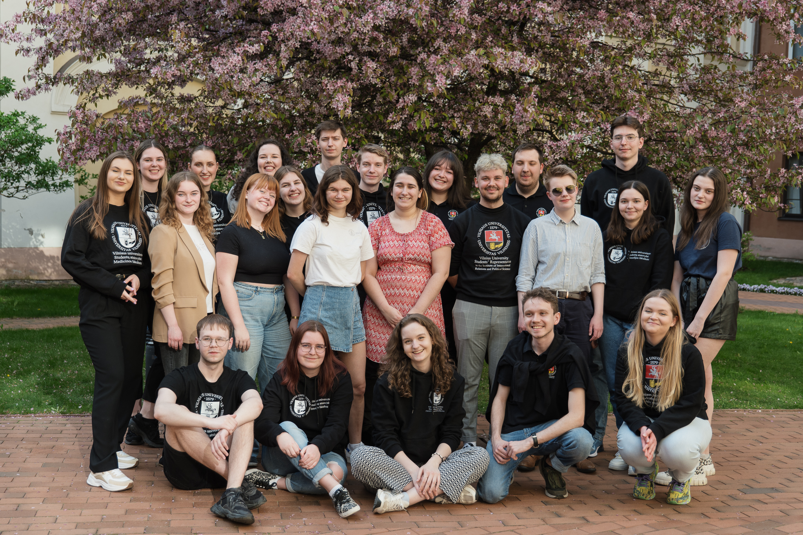

# VU SA Parlamentas

::: tip 📖 VU SA Parlamentas – tai...
VU SA valdymo organas, svarstantis svarbiausius
socialinius ir akademinius, su studentais (-ėmis) susijusius ar kitus VU
SA strateginius klausimus.

VU SA Parlamentą sudaro:

- organizacijos prezidentas
- viceprezidentas
- atstovavimo funkciją vykdančių VU SA
- padalinių pirmininkai (-ės) ir po du atstovus (-es) iš kiekvieno padalinio.

VU SA Parlamento darbą organizuoja pirmininkas.
:::

VU SA Parlamentui pirmininkavo Daniel Šematovič.

::: details 2023-2024 m. VU SA Parlamentą sudarė:

- **VU SA Prezidentė** Lijana Savickienė
- **VU SA CHGF**: Agnė Dirmantaitė, Lukas Vaškūnas, Justė Urbaitė
- **VU SA EVAF**: Ieva Lipskytė, Justas Giraitis, Ieva Gruodytė
- **VU SA FilF**: Rapolas Antanavičius, Algirdas Geležnis, Marijonas Kavaliauskas (iki 2023 m. gruodžio mėn.), Gabija Smailytė (nuo 2023 m. gruodžio mėn.)
- **VU SA FsF**: Samanta Valiušaitytė, Albertas Apanavičius, Daniel Šematovič
- **VU SA FF**: Justas Lebedevas, Uršulė Tarvydytė, Martynas Keršys
- **VU SA GMC**: Martyna Vaitkūnaitė, Lukas Krasauskas, Uršulė Barkauskaitė
- **VU SA IF**: Deimantė Grašytė, Vilija Valiukonytė, Fausta Ivaškevičiūtė (iki 2023 m. lapkričio mėn.), Neda Rasimavičiūtė (nuo 2023 m. lapkričio mėn.)
- **VU SA KnF**: Titas Repšys, Karolina Latyševaitė, Rokas Stankūnas
- **VU SA KF**: Lukrecija Kociūtė, Kotryna Katinaitė, Nedas Svetlikauskas
- **VU SA MIF**: Lukas Jakonis, Dominykas Venclovas, Ugnė Baublytė
- **VU SA MF**: Lurdes Gaidelytė, Goda Malijauskaitė, Oleksandra Levchenko
- **VU SA ŠA**: Gerda Petrošiūtė, Arnoldas Žebrauskas, Šarlota Tuzova
- **VU SA TSPMI**: Haroldas Žalūda, Akvilė Stankūnaitė, Arshpari Goel
- **VU SA TF**: Guoda Baubaitė, Povilas Plikūnas, Austėja Martišiūtė
- **VU SA VM**: Sofija Kavaliauskaitė, Edgaras Kodis, Ieva Agėjevaitė

:::

Ataskaitiniu laikotarpiu įvyko 8 Parlamento posėdžiai, 2 el. Balsavimai, 2 mokymai (išvažiuojamieji ir vietiniai) ir 1 darbo sesija.

## Parlamente priimti nutarimai dėl pozicijų ir rezoliucijų

### Priimta pozicija dėl Vilniaus universiteto doktorantūros studijų, vykdomų kartu su kitomis aukštosiomis mokyklomis ar mokslo institutais

VU SA Parlamentas priėmė poziciją, jog doktorantūros studentams (-ėms), studijuojantiems (-čioms) doktorantūros studijas, kurios yra vykdomos Vilniaus universiteto kartu su kitomis aukštosiomis mokyklomis ar mokslo institutais, turi būti sudaromos su kitais (-omis) trečios pakopos studijų studentais (-ėmis) lygiaverčios sąlygos gauti studijų ar su studijomis susijusius išteklius. Taip pat pabrėžta, jog Vilniaus universitetas turi užtikrinti tokių doktorantūros studijų kokybę.

### Priimta pozicija dėl Vilniaus universiteto doktorantūros studijų krepšelio lėšų panaudojimo

VU SA Parlamentas, atkreipdamas dėmesį į skirtingas ir dažnu atveju neįtvirtintas VU KAP doktorantūros lėšų panaudojimo tvarkas, priėmė poziciją dėl skaidresnio jų panaudojimo.

### Priimta rezoliucija dėl dirbtinio intelekto įrankių naudojimo studijų procese

VU SA Parlamentas, reaguodamas į pasaulyje ypač aktualų dirbtinio intelekto įrankių panaudojimo studijų procese klausimą, patvirtino poziciją, teigiančią, jog dirbtinio intelekto įrankių naudojimas studijose neturi būti draudžiamas. Tam, kad šie įrankiai studijų procese būtų naudojami tikslingai, būtina kelti visų VU akademinės bendruomenės narių kompetencijas.

### Priimta pozicija dėl tarpkryptinių studijų įtraukimo į studijų krypčių ir krypčių grupių, pagal kurias vyksta studijos aukštosiose mokyklose, sąrašą

VU SA Parlamentas pasisakė už tarpkryptinių studijų įtraukimo į studijų krypčių ir jų grupių sąrašą, suteikiant galimybę vykdyti tarpkryptines II pakopos studijas, kuriose nebūtų išreikšta kažkuri viena studijų kryptis.

### Patvirtintas VU SA Tvarumo žemėlapis

VU SA Parlamentas patvirtino iš VU SA Strateginio plano 2022-2025 m. kylantį Tvarumo žemėlapį. Žemėlapis apima visus padalinius ir daugumą Universiteto bendro naudojimo patalpų. Įgyvendinant šį žemėlapį, siekiama skatinti universiteto bendruomenės narius priimti tvarius kasdienius sprendimus, pritaikant Universiteto aplinką, kad tą daryti būtų patogu. Žemėlapis apima daugelį sričių: nuo rūšiavimo infrastruktūros, maisto dalinimosi iniciatyvų bendrabučiuose iki vegetariškos mitybos opcijų valgyklose didinimo, tvarumui skirtų dalykų integravimą į studijų dalykus.

## Kiti pažymėtini su Parlamento veikla susiję nutarimai

- Rengti pasiūlymai politinėms partijoms, dalyvausiančioms 2024 m. LR Seimo rinkimuose
- Parengta atnaujinta Pavyzdinių VU SA padalinių, vykdančių atstovavimo funkciją, nuostatų redakcija
- Pradėti rengti VU SA Iniciatyvų skatinimo fondo nuostatai
- Išrinkti studentų atstovai (-ės) į Vilniaus universiteto Senatą
- Patvirtintas VU SA 2024 m. biudžetas
- Patvirtintas VU SA 2023-2024 m. m. veiklos planas
- Diskutuota studijų mobilumo, integracijos, darnaus vystymosi bei negalios temomis.
