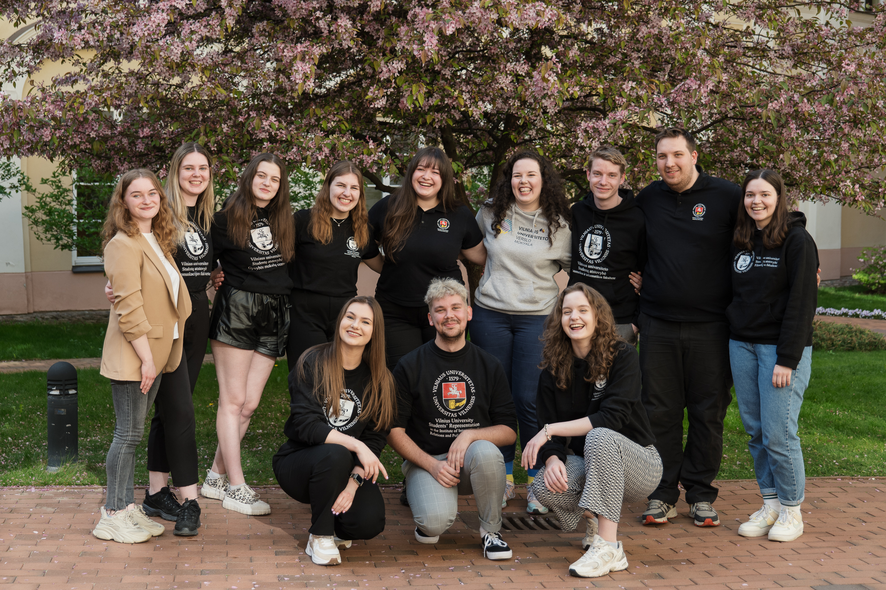

# VU SA taryba

{.rounded-sm}

::: tip **VU SA Taryba** - tai...
VU SA valdymo organas, sprendžiantis
bendradarbiavimo ir organizacijos vidaus klausimus. Šį valdymo organą
sudaro atstovavimo funkciją vykdančių Organizacijos padalinių vadovai
(pirmininkai) ir prezidentas, kuris organizuoja šio valdymo organo
veiklą.
:::

::: details 2023–2024 m. VU SA Tarybą sudarė...

<section class="grid grid-cols-1 sm:grid-cols-2 gap-6 p-4" >
    <PersonAvatar :src="member.avatar" v-for="member in taryba" >
    

        <strong class="text-md/4">{{member.name}}</strong>
        {{ member.title}}

    </PersonAvatar>
</section>

:::

Ataskaitiniu laikotarpiu įvyko 15 VU SA Tarybos posėdžių, iš kurių 6 buvo elektroniniai VU SA Tarybos posėdžiai. Taip pat, įvertindama didesnę prasmę diskusijoms ir bendrų Tarybos pozicijų paieškoms, šiemet VU SA Taryba veikė svarstydama vidaus ir institucinio stiprinimo klausimus ir VU SA Tarybos darbo sesijų metu, kurių einamuoju laikotarpiu įvyko 4.

## VU SA Taryba 2023–2024 m. svarstė ir / arba priėmė šiuos sprendimus:

Patvirtino VU SA Institucinio fondo sudėtį;

Patvirtino CO2 darbo grupės veiklos ataskaitą;

- Aptarė padalinių koordinatorių pareigybinių aprašų bendrosios dalies pokyčius;
- Priėmė sprendimą dėl tvarumo pirmakursių stovyklose įgyvendinimo;
- Apžvelgė VU SA konsultavimo procesą ir sutarė dėl 2023–2024 m. studentų (-čių) konsultavimo vykdymo;
- Atnaujino VU SA programos „Sąžiningai“ veiklą – atsisakė egzaminų stebėjimo ir pritarė edukacinių akademinės etikos veiklų plėtrai;
- Vertino gautus bendradarbiavimo pasiūlymus organizacijoje ir patarė dėl jų vykdymo / atsisakymo;
- Sudarė vertimo darbo grupę, kurioje buvo atnaujinti Organizacijos vidaus dokumentai, siekiant juos pritaikyti užsienio studentams (-ėms) ir tarptautiniams (-ėms) Organizacijos nariams (-ėms);
- Aptarė doktorantų (-čių) mentorystę, doktorantų (-čių) vadovų (-ių) mokymų poreikį ir konceptą, jungtinių doktorantūrų klausimus;
- Aptarė maldos kambarių poreikį akademiniuose miesteliuose ir sutarė dėl fakultetų / neakademinių padalinių, kuriuose reikalingas maldos kambarių įdiegimas;
- Sudarė neformalią atviro mokslo ir studijų darbo grupę, kuri rengs pasiūlymus Vilniaus universiteto Mokymosi visą gyvenimą centrui;
- Atnaujino VU SA komunikacijos strategiją;
- Rengė VU SA biudžetą bei tvirtino finansines renginių, programų bei projektų sąmatas einamuoju laikotarpiu.
